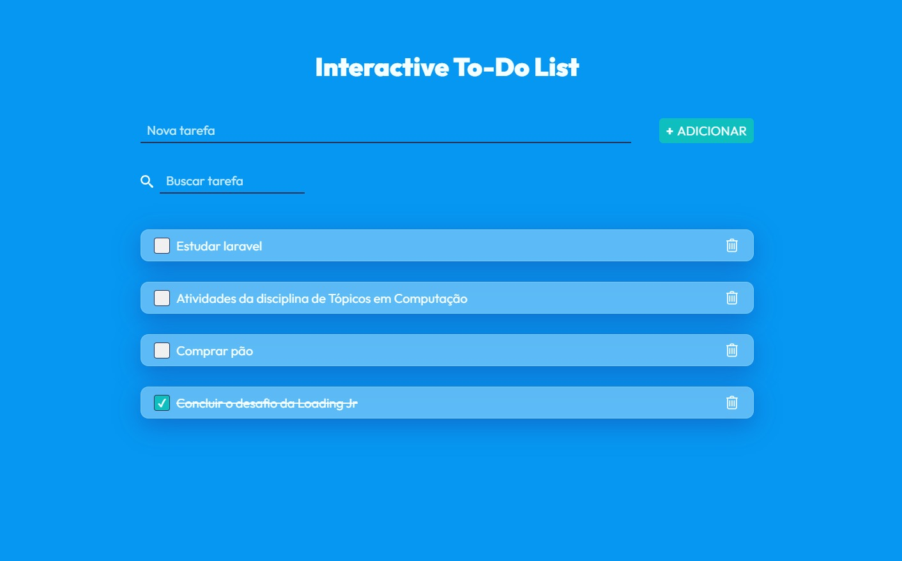

## **<h2 align="center"> Interactive To-do List 📝</h2>**

## :pushpin: Sobre este projeto:
Trata-se de uma lista de tarefas em que o usuário pode visualizar, adicionar e gerenciar suas atividades, permitindo a filtragem por nome. Foi desenvolvida utilizando ReactJs e Styled-Components, o que facilitou a implementação de técnicas de responsividade, reutilização de código e modificações futuras. Isso se deve ao fato de o React ser baseado em componentes, o que torna mais ágil a localização de pequenas partes de código, em contraposição a códigos extensos.

Este projeto é resultado de um desafio proposto pela equipe da Loading jr durante o seu processo seletivo. Busquei atender a todos os requisitos estabelecidos, como responsividade, adição de armazenamento local e proporcionar uma experiência visual agradável ao usuário.
 

## :rocket: Tecnologia usada:

  

 

## :star: Tela principal da aplicação

  

 

<h3 align="center"> 
	Application status: Developed ✔️
</h3>
 

## :information_source: Como rodar o projeto

Use: 

    - "git clone https://github.com/IgorPierre/interactive-to-do-list.git" para clonar o repositório.

    - "npm install" para instalar as dependências do projeto.

    - "npm run dev" para rodar o projeto em seu servidor local.

 
